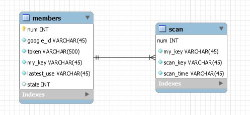

# 코로나 접촉자 추적 알림 APP - dahda

- BLE를 활용하여 정확한 접촉여부를 알 수 있는 **핵심적인 알림**
- 민감 정보를 사용하지 않아 **개인정보 유출에 대한 우려 감소**

## 캡스톤 역할

0. 나노로 ros 포팅
1. 서버 기능 추가. 알림 저장 (협업)
2. 코어 제작
3. 맵/로봇 위치 매핑, 명령기능 (협업)
4. 소리 방향/인식 개선
5. 방향 인식 연속화

### 수진
html파일들 합치기
농아 교재,
사용자친화적 개선

+ 매핑하면서 돌아다니기.
+ 매핑 모드 / 사용 모드 구분.

추가적용: 알람, 부딪히기? 등? 단계 나눠서. (빛,알람,부딪히기)

젯슨 나노 5v. 전압 강하시켜서 (컨버터 좋은것 써야함) 사용.

서버 기능 추가.
소리 방향,인식 개선
젯슨 나노로 포팅
코어 제작

## Main feature
| 기능 | 설명 |
| ------ | ------ |
| BLE Scan | 저전력 블루투스 스캔을 통해 15분간 접촉자의 정보를 스캔하여 서버에 전송 |
| 접촉 알림 | 확진자 발생시 추적 알고리즘을 통해 접촉자 전원에게 즉시 접촉 알림 | 

### Editor & IDE
- [Android Studio](https://developer.android.com/studio/index.html) : Mobile Application 제작
- [Atom](https://atom.io) : Node.js 서버 작성 및 개발 에디터
- [VScode](https://https://code.visualstudio.com/) : Node.js 서버 작성 및 개발 에디터

### AWS
- [AWS EC2](https://aws.amazon.com/ko/ec2/) : 클라우드 컴퓨팅
- [AWS RDS](https://aws.amazon.com/ko/rds/) : 클라우드 데이터 베이스
- [AWS VPC](https://aws.amazon.com/ko/vpc/) : Virtual Private Cloud

### Etc
- [Node.js](https://nodejs.org/) : 자바스크립트 기반 백엔드 프레임워크
- [MySQL](https://www.mysql.com) : 관계형 데이터베이스 관리 시스템(RDBMS)

## AWS Architecture
### System Structure

### Network Structure

### Database ER-diagram

## WiKi

- [API Referenct](https://13.125.91.162/swmaestro/nice/-/wikis/API-Reference)
- [DataBase Struct](https://13.125.91.162/swmaestro/nice/-/wikis/DataBase-Struct)
- [Sequence charts](https://13.125.91.162/swmaestro/nice/-/wikis/Sequence-charts)
- [ngrok tunneling](https://13.125.91.162/swmaestro/nice/-/wikis/ngrok-tunneling)