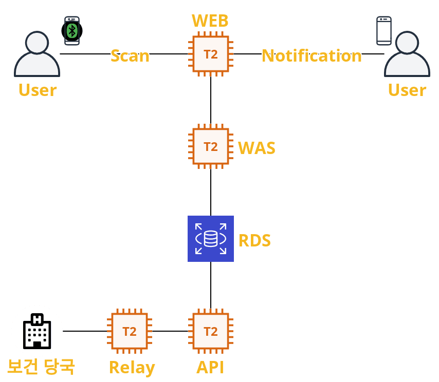

    

# Overview

    

- BLE를 활용하여 정확한 접촉여부를 알 수 있는 **핵심적인 알림**
- 민감 정보를 사용하지 않아 **개인정보 유출에 대한 우려 감소**

## Main feature
| 기능           | 설명                                                         |
| -------------- | ------------------------------------------------------------ |
| BLE Scan       | 저전력 블루투스 스캔을 통해 15분간 접촉자의 정보를 스캔하여 서버에 전송 |
| 접촉 알림      | 확진자 발생시 추적 알고리즘을 통해 접촉자 전원에게 즉시 접촉 알림 |
| 접촉 위치 파악 | 확진자와의 접촉 시간을 통해 스마트폰에 저장되어있는 위치 정보와 매칭하여 접촉 위치를 제공 |

    

## Editor & IDE
- [Android Studio](https://developer.android.com/studio/index.html) : Mobile Application 제작
- [Atom](https://atom.io) : Node.js 서버 작성 및 개발 에디터
- [VScode](https://https://code.visualstudio.com/) : Node.js 서버 작성 및 개발 에디터

## AWS
- [AWS EC2](https://aws.amazon.com/ko/ec2/) : 클라우드 컴퓨팅
- [AWS RDS](https://aws.amazon.com/ko/rds/) : 클라우드 데이터 베이스
- [AWS VPC](https://aws.amazon.com/ko/vpc/) : Virtual Private Cloud

## Etc
- [Node.js](https://nodejs.org/) : 자바스크립트 기반 백엔드 프레임워크
- [MySQL](https://www.mysql.com) : 관계형 데이터베이스 관리 시스템(RDBMS)

## AWS Architecture
### System Structure

    

### Network Structure

    

### Database ER-diagram

    

## WiKi

- [API Referenct](https://13.125.91.162/swmaestro/nice/-/wikis/API-Reference) : 닿다 어플리케이션의 전반적인 API 관련

- [AWS Structure](https://13.125.91.162/swmaestro/nice/-/wikis/AWS-Structure) : AWS 구조와 네트워크 구조등을 설명

- [DataBase Structure](https://13.125.91.162/swmaestro/nice/-/wikis/DataBase-Structure) : Database 스키마 구조와 SQL을 표기

- [Sequence charts](https://13.125.91.162/swmaestro/nice/-/wikis/Sequence-charts) : 시스템의 전반적인 흐름을 볼 수 있음

- [ngrok tunneling](https://13.125.91.162/swmaestro/nice/-/wikis/ngrok-tunneling) : 개발을 용이하게 하기 위한 grok 터널 사용 예시 표기
