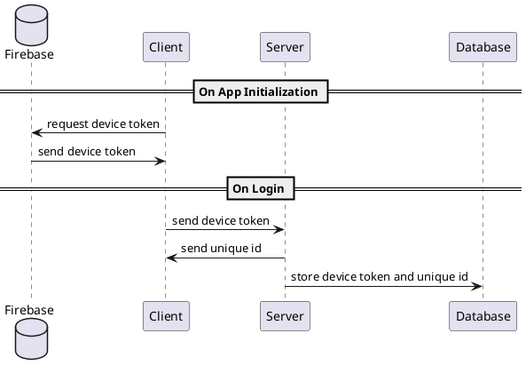
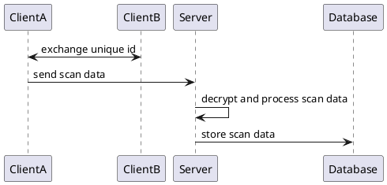
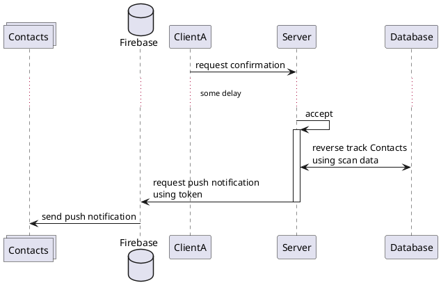

## Login

```plantuml
@startuml
== On App Initialization ==
database Firebase
Client -> Firebase : request device token
Firebase -> Client : send device token
== On Login ==
Client -> Server : send device token
Server -> Client : send unique id
Server -> Database : store device token and unique id
@enduml
```

## Scan

```plantuml
@startuml
ClientA <-> ClientB : exchange unique id
ClientA -> Server : send scan data
Server -> Server : decrypt and process scan data
Server -> Database : store scan data
@enduml
```

## Confirm

```plantuml
@startuml
collections Contacts
database Firebase
ClientA -> Server : request confirmation
... some delay ...
Server -> Server : accept
activate Server
Server <-> Database : reverse track Contacts\nusing scan data
Server -> Firebase : request push notification\nusing token
deactivate Server
Firebase -> Contacts : send push notification
@enduml
```